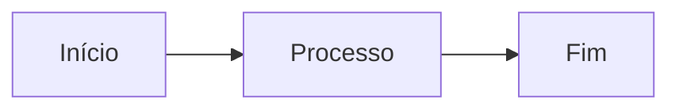

# 🚀 Hymple Whitepaper - Documentação Profissional

> **Whitepaper profissional estilo GitBook para projetos Web3 de alta tecnologia**

[](https://squidfunk.github.io/mkdocs-material/)
[](https://www.python.org/)

## ✨ Features Implementadas

### 🎨 Design Profissional
- ✅ Tema GitBook moderno e elegante
- ✅ Paleta de cores profissional Web3
- ✅ Tipografia otimizada (Inter + Roboto Mono)
- ✅ Modo claro/escuro automático
- ✅ Animações e transições suaves
- ✅ Responsive design mobile-first

### 🔧 Funcionalidades Avançadas
- ✅ Navegação inteligente com breadcrumbs
- ✅ Busca instantânea com sugestões
- ✅ Índice lateral (TOC) integrado
- ✅ Navegação com tabs sticky
- ✅ Barra de progresso de carregamento
- ✅ Footer com redes sociais
- ✅ Feedback de páginas úteis

### 📝 Recursos de Conteúdo
- ✅ Syntax highlighting para múltiplas linguagens
- ✅ Diagramas Mermaid (flowcharts, sequências)
- ✅ Fórmulas matemáticas com MathJax
- ✅ Admonitions/Callouts personalizados
- ✅ Tabs de conteúdo
- ✅ Tabelas profissionais
- ✅ Cards de navegação customizados
- ✅ Badges crypto/Web3
- ✅ Feature grids
- ✅ Abreviações DeFi/Web3 automáticas

### 🚀 Performance & SEO
- ✅ Minificação HTML/CSS/JS
- ✅ Otimização de imagens (GLightbox)
- ✅ Meta tags otimizadas
- ✅ Sitemap automático
- ✅ Google Analytics integrado
- ✅ Cache inteligente

## 📦 Instalação Rápida

```bash
# 1. Instalar dependências
pip install mkdocs-material mkdocs-glightbox mkdocs-git-revision-date-localized-plugin mkdocs-minify-plugin

# 2. Iniciar servidor de desenvolvimento
cd /home/jeferson/workspace/hymple.docs
mkdocs serve

# 3. Acessar em http://127.0.0.1:8000
```

## 🎯 Quick Start

### Comandos Principais

```bash
# Servidor de desenvolvimento (auto-reload)
mkdocs serve

# Build para produção
mkdocs build

# Deploy no GitHub Pages
mkdocs gh-deploy

# Validar configuração
mkdocs build --strict
```

### Estrutura de Pastas

```
hymple.docs/
├── 📄 mkdocs.yml              # Configuração principal
├── 📁 docs/
│   ├── 📄 index.md           # Homepage
│   ├── 📄 introduction.md    # Introdução do whitepaper
│   ├── 📄 examples.md        # Exemplos de recursos
│   ├── 📁 assets/            # Imagens e mídia
│   ├── 📁 stylesheets/
│   │   └── styles.css        # CSS customizado GitBook
│   └── 📁 javascripts/
│       └── mathjax.js        # Config MathJax
├── 📁 includes/
│   └── abbreviations.md      # Glossário DeFi/Web3
└── 📁 site/                   # Build output
```

## 🎨 Personalização

### Cores do Tema

Edite as variáveis CSS em `docs/stylesheets/styles.css`:

```css
:root {
  --gitbook-primary: #18214D;   /* Azul escuro principal */
  --gitbook-accent: #3B82F6;    /* Azul destaque */
  --gitbook-success: #10B981;   /* Verde sucesso */
  --gitbook-warning: #F59E0B;   /* Amarelo aviso */
  --gitbook-danger: #EF4444;    /* Vermelho perigo */
}
```

### Adicionar Páginas

1. Crie arquivo `.md` em `docs/`
2. Adicione à navegação em `mkdocs.yml`:

```yaml
nav:
  - Home: index.md
  - Whitepaper:
    - Sua Nova Página: nova-pagina.md
```

### Adicionar Idiomas

Edite `mkdocs.yml`:

```yaml
theme:
  language: pt  # Português
```

## 📚 Recursos Disponíveis

### Cards de Navegação

```html
<div class="nav-cards">
  <a href="link/" class="nav-card">
    <div class="nav-card-header">
      <span class="nav-card-icon">🚀</span>
      CATEGORIA
    </div>
    <h3 class="nav-card-title">Título</h3>
    <p class="nav-card-description">Descrição</p>
  </a>
</div>
```

### Badges Crypto

```html
<span class="crypto-badge">DeFi</span>
<span class="crypto-badge">Web3</span>
```

### Admonitions

```markdown
!!! note "Nota"
    Conteúdo da nota

!!! tip "Dica"
    Dica profissional

!!! warning "Aviso"
    Alerta importante
```

### Diagramas

````markdown

````

### Fórmulas Matemáticas

```markdown
Inline: \(x^2 + y^2 = z^2\)

Display:
\[
E = mc^2
\]
```

### Code Blocks

````markdown
```python
def hello_world():
    print("Hello, Hymple!")
```

```solidity
contract Token {
    string public name = "Hymple";
}
```
````

## 🌐 Deploy

### GitHub Pages

```bash
# Configurar repositório
git remote add origin https://github.com/hy-mple/hymple.docs

# Deploy automático
mkdocs gh-deploy
```

### Netlify

1. Conecte seu repositório
2. Build command: `mkdocs build`
3. Publish directory: `site`

### Vercel

1. Importe repositório
2. Framework: Other
3. Build: `pip install mkdocs-material && mkdocs build`
4. Output: `site`

## 🔧 Configurações Avançadas

### Google Analytics

Adicione sua chave em `.env`:

```bash
export GOOGLE_ANALYTICS_KEY="G-XXXXXXXXXX"
```

### Redes Sociais

Edite em `mkdocs.yml`:

```yaml
extra:
  social:
    - icon: fontawesome/brands/github
      link: https://github.com/seu-usuario
    - icon: fontawesome/brands/twitter
      link: https://twitter.com/seu-perfil
```

### Custom Domain

Crie arquivo `docs/CNAME`:

```
docs.hymple.exchange
```

## 📖 Exemplos de Uso

Veja exemplos completos em [examples.md](docs/examples.md):

- ✨ Cards de navegação
- 🎨 Feature grids
- 📊 Tabelas profissionais
- 🔀 Diagramas Mermaid
- 📐 Fórmulas matemáticas
- 💻 Code blocks com múltiplas linguagens
- 📝 Admonitions e callouts
- 🔖 Tabs de conteúdo

## 🎯 Comparação com GitBook

| Feature | Hymple MkDocs | GitBook |
|---------|---------------|---------|
| **Open Source** | ✅ Sim | ❌ Parcial |
| **Custo** | 💚 Grátis | 💰 Pago |
| **Customização** | ⭐⭐⭐⭐⭐ | ⭐⭐⭐ |
| **Performance** | ⚡ Excelente | ⚡ Boa |
| **Hospedagem** | 🌐 Qualquer | 🏢 GitBook |
| **Offline** | ✅ Sim | ❌ Não |
| **Markdown** | ✅ Puro | ✅ Compatível |

## 🤝 Contribuindo

Contribuições são bem-vindas! Sinta-se à vontade para:

- 🐛 Reportar bugs
- 💡 Sugerir features
- 📝 Melhorar documentação
- 🎨 Aprimorar design

## 📄 Licença

Este projeto está sob a licença MIT.

## 🙏 Créditos

- [MkDocs Material](https://squidfunk.github.io/mkdocs-material/)
- [Mermaid](https://mermaid.js.org/)
- [MathJax](https://www.mathjax.org/)
- Inspirado no design do [GitBook](https://www.gitbook.com/)

## 📞 Suporte

- 📧 Email: support@hymple.exchange
- 💬 Discord: [discord.gg/hymple](https://discord.gg/hymple)
- 🐦 Twitter: [@hymple](https://twitter.com/hymple)
- 📖 Docs: [docs.hymple.exchange](https://docs.hymple.exchange)

---

<div align="center">

**Feito com ❤️ para a comunidade Web3**

[Documentação](https://docs.hymple.exchange) • [Website](https://hymple.exchange) • [GitHub](https://github.com/hy-mple)

</div>
