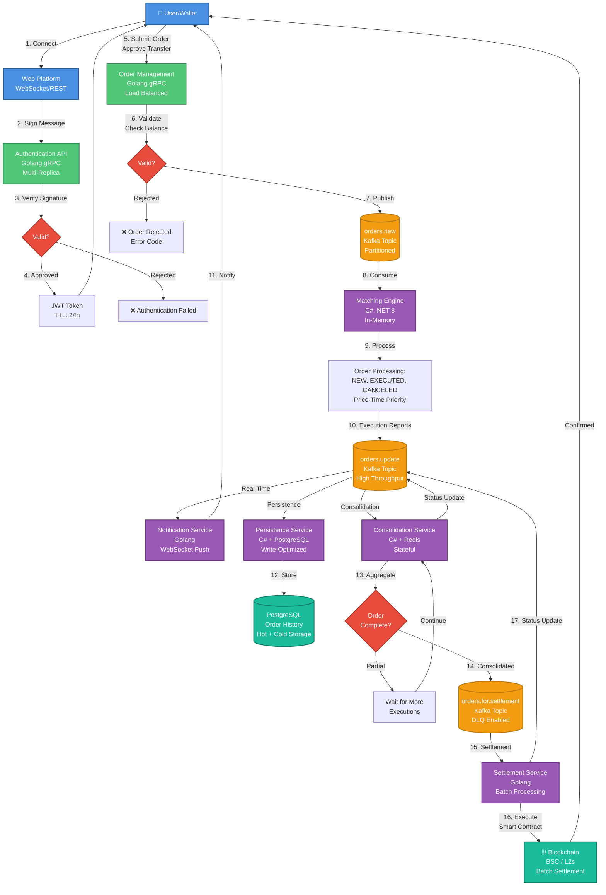

# Order Submission and Execution Flow Architecture

## Executive Overview

This document specifies the technical architecture of Hymple Exchange's order submission, execution, and settlement system. The platform implements a high-performance hybrid architecture that combines the operational efficiency of centralized exchanges (CEX) with the sovereignty and transparency of decentralized exchanges (DEX).

**Architectural Principles:**
- **Ultra-low latency**: <10ms for order acknowledgment
- **High availability**: 99.99% uptime SLA
- **Horizontal scalability**: Capacity for >100,000 TPS
- **Event-driven & loosely coupled**: Service resilience and independence
- **Complete auditability**: Immutable audit trail for compliance

## Architectural Diagram



## System Components

### 1. **Authentication Layer**

**Service**: `hymple.exchange.auth`  
**Technology Stack**: Golang 1.22+, gRPC, Redis (session cache)  
**Deployment Strategy**: Kubernetes Deployment with HPA (Horizontal Pod Autoscaler)

#### Features
- Validation of wallet cryptographic signatures (ECDSA secp256k1)
- JWT token issuance (HS256) with custom claims
- Rate limiting per IP address and wallet
- Replay attack detection through nonces
- Support for multiple wallet providers (MetaMask, WalletConnect, etc.)

#### Performance Metrics
- **P99 Latency**: <15ms
- **Throughput**: 50,000 req/s per replica
- **Availability**: 99.99%
- **Minimum replicas**: 3 (production)

#### Security
- Off-chain signature validation
- Tokens with configurable expiration (default: 24h)
- Refresh tokens for long sessions
- Blacklist of compromised tokens (Redis)
- Audit log of all authentications

---

### 2. **Order Management API**

**Service**: `hymple.exchange.orders`  
**Technology Stack**: Golang 1.22+, gRPC, Protocol Buffers  
**Deployment Strategy**: Multi-AZ with load balancer (AWS ALB / GCP LB)

#### Features
- Reception and validation of orders (LIMIT, MARKET, STOP-LIMIT, OCO)
- Real-time balance validation (integration with balance service)
- Pre-trade risk checks (exposure limits, daily limits)
- Order enrichment (timestamp, order ID, user context)
- Publication to Kafka with delivery guarantee (acks=all)

#### Pre-Execution Validations
1. **Format Validation**: Schema validation (Protocol Buffers)
2. **Authentication Validation**: JWT verification and permissions
3. **Balance Validation**: Query to balance service with cache
4. **Risk Validation**: Limits per user and per trading pair
5. **Market Validation**: Active trading pair verification
6. **Price Validation**: Price collar checks (±10% of last price)

#### Performance Metrics
- **P99 Latency**: <10ms (pre-kafka publish)
- **Throughput**: 100,000 orders/s (aggregate)
- **Rejection rate**: <0.1% (valid orders)
- **Availability**: 99.99%

#### Error Codes (RFC 7807)
- `ORD-001`: Invalid order format
- `ORD-002`: Insufficient balance
- `ORD-003`: Invalid or inactive trading pair
- `ORD-004`: Price outside allowed collar
- `ORD-005`: Quantity below minimum
- `ORD-006`: Exposure limit exceeded
- `ORD-007`: Rate limit exceeded

---

### 3. **Matching Engine (Order Book)**

**Service**: `hymple.exchange.order.book`  
**Technology Stack**: C# .NET 8, In-Memory Data Structures  
**Deployment Strategy**: Dedicated instances per asset or asset group

#### Matching Engine Architecture

##### Matching Algorithm
- **Price-Time Priority**: Best price first, same price = first to arrive
- **Data structure**: Red-Black Trees for order books (O(log n) insert/delete)
- **Deterministic execution**: Guaranteed processing order
- **Partial fills**: Full support for partial executions
- **Fill-or-Kill (FOK)**: Complete execution or cancellation
- **Immediate-or-Cancel (IOC)**: Immediate partial execution

##### Supported Order Types
- **LIMIT**: Order with specific price
- **MARKET**: Immediate execution at best available price
- **STOP-LOSS**: Order activated when price reaches trigger
- **STOP-LIMIT**: Stop-loss with price limit
- **OCO (One-Cancels-Other)**: Two linked orders
- **Trailing Stop**: Dynamic stop loss

##### Order States
1. **NEW**: Order accepted and inserted in book
2. **PARTIALLY_FILLED**: Partial execution in progress
3. **FILLED**: Order completely executed
4. **CANCELED**: Order canceled by user
5. **REJECTED**: Order rejected by system
6. **EXPIRED**: Order expired (GTC, GTD)

#### Performance Metrics
- **Matching Latency**: <1ms (P99)
- **Throughput**: 1,000,000 matches/s per instance
- **Capacity**: 500,000 active simultaneous orders per book
- **Market depth updates**: >1000 updates/s

#### Optimizations
- Lock-free data structures where possible
- Zero-allocation hot paths
- Memory pooling for frequent objects
- NUMA-aware memory allocation
- CPU pinning for critical threads

---

### 4. **Event-Driven Services**

#### 4.1 Notification Service

**Service**: `hymple.exchange.orders.notification`  
**Technology Stack**: Golang, WebSocket, Server-Sent Events (SSE)

##### Features
- Persistent WebSocket connections with heartbeat
- Broadcasting of order updates in real time
- Support for multiple devices per user
- Fallback to SSE in restricted environments
- Message compression (gzip, brotli)
- Customizable subscription filters

##### Metrics
- **Delivery latency**: <5ms (P95)
- **Simultaneous connections**: 100,000+ per instance
- **Message rate**: 1,000,000 msgs/s (aggregate)
- **Reconnection rate**: <2% (under normal conditions)

---

#### 4.2 Persistence Service

**Service**: `hymple.exchange.orders.persistence`  
**Technology Stack**: C# .NET 8, MySQL 8.0

##### Features
- Persistence of all order events (event sourcing)
- Execution reports storage
- Trade history (hot storage: 90 days, cold storage: infinite)
- Optimized indexing for common queries
- Partitioning by time range
- Continuous backup and point-in-time recovery


##### Metrics
- **Write throughput**: 50,000 writes/s
- **Write latency**: <10ms (P99)
- **Retention**: Hot (90d), Warm (1y), Cold (infinite)
- **Backup RPO**: <1 minute

---

#### 4.3 Consolidation Service

**Service**: `hymple.exchange.orders.consolidator`  
**Technology Stack**: C# .NET 8, Redis (state management)

##### Features
- Aggregation of partial executions per order
- Volume-weighted average price (VWAP) calculation
- Detection of completely filled orders
- Generation of consolidated reports for settlement
- Retry logic with exponential backoff
- Guaranteed idempotency

##### Consolidation Logic
```
For each order:
  1. Aggregate all executions
  2. Calculate total filled_quantity
  3. Calculate volume-weighted average price
  4. Calculate total fees
  5. If filled_quantity == order_quantity:
     -> Mark as FILLED
     -> Publish to orders.for.settlement
  6. Otherwise:
     -> Wait for more executions
```

##### Metrics
- **Consolidation latency**: <20ms (P95)
- **Throughput**: 50,000 consolidations/s
- **Error rate**: <0.01%

---

#### 4.4 Settlement Service

**Service**: `hymple.exchange.orders.settlement`  
**Technology Stack**: Golang, Web3, Smart Contracts (Solidity)

##### Features
- On-chain settlement execution via smart contracts
- Batch settlement for gas optimization
- Automatic retry on network failures
- Multi-chain support (BSC, Arbitrum, Optimism, Base)
- Blockchain confirmation monitoring
- Reconciliation between off-chain and on-chain balance

##### Settlement Process
1. **Aggregation**: Group orders by user and asset
2. **Batch creation**: Create batch of up to 100 orders
3. **Gas estimation**: Estimate required gas
4. **Transaction submission**: Submit transaction to blockchain
5. **Confirmation monitoring**: Wait for confirmations (12 blocks)
6. **Status update**: Publish final status

##### Gas Optimizations
- Batch settlement reduces costs by ~80%
- EIP-2930 access lists
- Storage slot optimization
- Use of events instead of storage for logs

##### Metrics
- **Settlement latency**: <30 seconds (BSC)
- **Average gas cost**: <$0.50 per batch
- **Success rate**: >99.9%
- **Throughput**: 10,000 settlements/minute

---

### 5. **Message Broker (Apache Kafka)**

**Technology Stack**: Apache Kafka 3.6+, Zookeeper/KRaft  
**Deployment Strategy**: Multi-AZ cluster with replication

#### Topics and Configurations

##### `orders.new`
- **Partitions**: 50 (partitioning by symbol hash)
- **Replication factor**: 3
- **Retention**: 7 days
- **Compression**: lz4
- **Min in-sync replicas**: 2

##### `orders.update`
- **Partitions**: 100 (partitioning by order_id hash)
- **Replication factor**: 3
- **Retention**: 30 days
- **Compression**: snappy
- **Min in-sync replicas**: 2

##### `orders.for.settlement`
- **Partitions**: 20
- **Replication factor**: 3
- **Retention**: 90 days (compliance)
- **Compression**: gzip
- **Min in-sync replicas**: 3 (critical)

#### Delivery Guarantees
- **Producer**: acks=all, retries=∞, idempotent=true
- **Consumer**: Manual offset management, exactly-once semantics
- **Dead Letter Queue (DLQ)**: For messages failing after N retries

#### Cluster Metrics
- **Throughput**: 10GB/s (aggregate)
- **Latency**: <10ms (P99)
- **Availability**: 99.99%
- **Messages/s**: 5,000,000+

---

## Detailed Execution Flow

### Phase 1: Authentication (Steps 1-4)

**Total time**: ~50ms

1. **Wallet Connection** (10ms)
   - User connects wallet via WalletConnect or injection
   - Platform requests account access
   
2. **Message Signing** (20ms)
   - Platform generates unique challenge (nonce)
   - User signs message with private key
   - Format: EIP-191 or EIP-712
   
3. **Signature Verification** (10ms)
   - Authentication API recovers public address
   - Validates that signature matches address
   - Verifies nonce hasn't been used (replay protection)
   
4. **Token Issuance** (10ms)
   - Generates JWT with claims: user_id, wallet_address, roles
   - Stores in Redis cache for fast validation
   - Returns token to client (TTL: 24h)

---

### Phase 2: Order Submission (Steps 5-7)

**Total time**: ~15ms

5. **Order Submission** (<1ms)
   - Client sends order via gRPC
   - Payload: symbol, side, type, price, quantity, timeInForce
   - Transfer approval (if first order): permit/approve
   
6. **Validation and Verification** (10ms)
   - **JWT Validation**: Verifies authenticity and expiration (1ms)
   - **Schema validation**: Protocol Buffers validation (0.5ms)
   - **Balance verification**: Cache-aside pattern with Redis (2ms)
   - **Risk checks**: Exposure limits and daily limits (2ms)
   - **Price collar**: Reasonable price validation (0.5ms)
   - **Order ID generation**: UUID v7 (time-ordered) (0.5ms)
   
7. **Kafka Publication** (4ms)
   - Serialization to Protocol Buffers (0.5ms)
   - Send to `orders.new` topic with acks=all (3ms)
   - Return acknowledgment to client (0.5ms)

**Response Codes**:
- `200 OK`: Order accepted
- `400 Bad Request`: Validation failed
- `401 Unauthorized`: Invalid token
- `429 Too Many Requests`: Rate limit
- `503 Service Unavailable`: System unavailable

---

### Phase 3: Order Processing (Steps 8-10)

**Total time**: ~2ms

8. **Kafka Consumption** (0.5ms)
   - Matching engine consumes message from `orders.new` topic
   - Protocol Buffers deserialization
   - Routing to specific order book (by symbol)
   
9. **Matching Engine** (1ms)
   - **Book insertion**: Red-Black Tree insertion (O(log n))
   - **Matching loop**: Search for compatible orders
     - For BUY: Search for best ASK (lowest price)
     - For SELL: Search for best BID (highest price)
   - **Execution**: Create execution reports for each match
   - **State update**: Modify filled quantity
   
10. **Execution Reports Publication** (0.5ms)
    - Generate execution reports (JSON or Protobuf)
    - Publish to `orders.update` topic
    - Broadcast to all interested consumers

**Execution Report Types**:
- `ORDER_NEW`: Order accepted in book
- `ORDER_TRADE`: Total or partial execution
- `ORDER_CANCEL`: Cancellation processed
- `ORDER_REJECT`: Rejection by matching engine
- `ORDER_EXPIRE`: Order expired

---

### Phase 4: Event Distribution (Steps 11-13)

**Total time (parallel)**: ~20ms

11. **Real-Time Notification** (5ms)
    - Notification service consumes `orders.update`
    - Identifies active WebSocket connections for user
    - Serializes message (compact JSON)
    - Push via WebSocket to all devices
    - Client updates UI instantly
    
12. **Database Persistence** (10ms)
    - Persistence service consumes `orders.update`
    - Batch insert into MySQL (batches of 100 messages)
    - Index update
    - Write to InnoDB redo log
    - Replication to standby servers
    
13. **Consolidation** (20ms)
    - Consolidation service consumes `orders.update`
    - Loads current order state from Redis
    - Aggregates new execution to state
    - Calculates VWAP (Volume Weighted Average Price)
    - If order complete → publishes to `orders.for.settlement`
    - Otherwise → updates state and waits

---

### Phase 5: On-Chain Settlement (Steps 14-17)

**Total time**: ~30 seconds (blockchain dependent)

14. **Settlement Preparation** (100ms)
    - Consolidator identifies completely filled order
    - Calculates net positions (per user and asset)
    - Groups orders in batch (up to 100 orders)
    - Publishes batch to `orders.for.settlement`
    
15. **Settlement Processing** (5s)
    - Settlement service consumes message
    - Validates data integrity
    - Estimates required gas (eth_estimateGas)
    - Adjusts gas price based on network conditions
    - Constructs transaction with settlement batch
    
16. **Blockchain Execution** (25s)
    - Signs transaction with hot wallet (HSM-protected)
    - Submits transaction to blockchain (BSC/L2)
    - Waits for block inclusion (~3s)
    - Waits for confirmations (12 blocks ~36s BSC, ~12s L2)
    - Reads events emitted by smart contract
    
17. **Final Status Update** (500ms)
    - Publishes confirmed settlement event to `orders.update`
    - Updates order status to `SETTLED`
    - Notifies user via WebSocket
    - Persists transaction hash and receipt
    - Updates user's on-chain balance

**Settlement States**:
- `PENDING`: Awaiting processing
- `SUBMITTED`: Transaction sent to blockchain
- `CONFIRMING`: Awaiting confirmations
- `CONFIRMED`: Settlement confirmed
- `FAILED`: Settlement failed (automatic retry)

---

## Padrões Arquiteturais Enterprise

### 1. Microserviços com Domain-Driven Design (DDD)

Cada serviço é responsável por um bounded context específico:
- **Auth Context**: Autenticação e autorização
- **Order Context**: Lifecycle de ordens
- **Matching Context**: Execução de trades
- **Settlement Context**: Liquidação on-chain
- **Notification Context**: Comunicação em tempo real

### 2. Event Sourcing & CQRS

**Event Sourcing**:
- All events are stored as immutable log
- Current state is derived from event replay
- Complete audit and temporal queries

**CQRS (Command Query Responsibility Segregation)**:
- **Command Side**: Submission APIs (Write)
- **Query Side**: Query APIs (Read)
- Separately optimized data models
- Eventual consistency between write and read models

### 3. Saga Pattern for Distributed Transactions

Implemented for flows involving multiple services:

**Example: Order Submission Saga**
1. Reserve balance → Success/Fail
2. Create order in book → Success/Compensate(1)
3. Persist order → Success/Compensate(1,2)
4. Notify user → Best effort

**Compensation on failure**:
- Automatic rollback of previous operations
- Compensation logs for debugging
- Alerts for operations requiring manual intervention

### 4. Circuit Breaker Pattern

Protection against failure cascades:

```
Circuit Breaker States:
- CLOSED: Normal operation
- OPEN: Failures detected, reject requests
- HALF_OPEN: Recovery test

Thresholds:
- Failure rate: >5% in 10s
- Timeout: >1s (P95)
- Recovery: 30s in OPEN state
```

### 5. API Gateway Pattern

**Unified gateway** for all services:
- Global and per-user rate limiting
- Centralized authentication (JWT validation)
- Request/Response logging
- Metrics aggregation
- Protocol translation (REST → gRPC)

---

## Complete Technology Stack

| Component | Technology | Justification |
|------------|-----------|---------------|
| **Entry APIs** | Golang 1.22+ | High concurrency, low latency |
| **Matching Engine** | C# .NET 8 | Performance, strong typing, tooling |
| **Message Broker** | Apache Kafka 3.6 | Massive throughput, durability |
| **Distributed Cache** | Redis 7.x (Cluster) | Sub-millisecond latency, pub/sub |
| **Database** | MySQL 8.0 (InnoDB) | ACID, high performance, replication |
| **Orchestration** | Kubernetes 1.28+ | Auto-scaling, self-healing |
| **Service Mesh** | Istio / Linkerd | mTLS, observability, traffic management |
| **Monitoring** | Prometheus + Grafana | Metrics and visualization |
| **Logging** | ELK Stack (Elasticsearch, Logstash, Kibana) | Centralized logs |
| **Tracing** | Jaeger / Tempo | Distributed tracing |
| **Blockchain** | Web3.js / Ethers.js | Smart contract interaction |
| **Load Balancer** | AWS ALB / GCP LB | Traffic distribution |
| **CDN** | CloudFlare | Edge caching, DDoS protection |

---

## Métricas de Performance (SLA)

### Latência End-to-End

| Operação | P50 | P95 | P99 | P99.9 |
|----------|-----|-----|-----|-------|
| Autenticação | 20ms | 40ms | 50ms | 80ms |
| Submissão de ordem | 8ms | 12ms | 15ms | 25ms |
| Matching | 0.5ms | 0.8ms | 1ms | 2ms |
| Notificação WS | 2ms | 4ms | 5ms | 10ms |
| Persistência DB | 5ms | 8ms | 10ms | 20ms |
| Settlement on-chain | 20s | 30s | 45s | 60s |

### Throughput

| Componente | Throughput |
|------------|-----------|
| Order API | 100.000 req/s (agregado) |
| Matching Engine | 1,000,000 matches/s per instance |
| Kafka Cluster | 5,000,000 msg/s |
| WebSocket Server | 100,000 connections/instance |
| Database Writes | 50,000 writes/s |

### Availability

| Service | SLA | Monthly Downtime |
|---------|-----|------------------|
| Order API | 99.99% | 4.32 minutes |
| Matching Engine | 99.95% | 21.6 minutes |
| Settlement Service | 99.9% | 43.2 minutes |
| Overall System | 99.95% | 21.6 minutes |

---

## Enterprise Security

### 1. Authentication and Authorization

- **mTLS** between all microservices
- **JWT** with automatic secret rotation
- **RBAC** (Role-Based Access Control) granular
- **API Keys** for third-party integrations
- **Rate limiting** adaptive based on ML

### 2. Data Protection

- **Encryption at rest**: AES-256 (database, backups)
- **Encryption in transit**: TLS 1.3
- **PII masking**: Logs don't contain sensitive data
- **Key management**: AWS KMS / HashiCorp Vault
- **Secret rotation**: Automatic every 90 days

### 3. Smart Contract Security

- **Multi-sig wallets** for critical operations
- **Time-locks** for contract upgrades
- **Pausable contracts** for emergencies
- **Reentrancy guards** on all payable functions
- **Periodic audits** (CertiK, Trail of Bits, OpenZeppelin)

### 4. Anomaly Detection

- **ML models** for wash trading detection
- **Behavioral analysis** to identify malicious bots
- **Pattern matching** for front-running attempts
- **Real-time alerts** for suspicious activities

---

## Disaster Recovery & Business Continuity

### Backup Strategy

**Databases**:
- Full backup: Daily at 00:00 UTC
- Incremental backup: Every hour
- Point-in-time recovery: Up to 30 days ago
- Cross-region replication: Synchronous (DR site)

**Kafka**:
- Topic replication: Factor 3 (multi-AZ)
- Configuration backup: Git (Infrastructure as Code)
- Disaster recovery cluster: Secondary region (standby)

### Automatic Failover

**Database**:
- MySQL Group Replication (multi-primary)
- Automatic failover with orchestrator
- RTO: <60 seconds
- RPO: <10 seconds

**Services**:
- Continuous health checks (readiness, liveness)
- Auto-healing: Kubernetes restart unhealthy pods
- Circuit breakers: Isolate failing services
- Graceful degradation: Reduced functionality vs. total downtime

### RTO & RPO Targets

| Component | RTO | RPO |
|------------|-----|-----|
| Order API | 1 minute | 0 (stateless) |
| Matching Engine | 5 minutes | <10 seconds |
| Database | 1 minute | <10 seconds |
| Settlement | 10 minutes | 0 (blockchain is source of truth) |

---

## Compliance and Audit

### Audit Trail

**Audited events**:
- All authentications (success and failure)
- Order submissions (accepted and rejected)
- Trade executions (with precise timestamps)
- Cancellations and modifications
- On-chain settlements (with TX hashes)
- Administrative accesses

**Log format**:
```json
{
  "timestamp": "2026-01-31T10:30:00.123Z",
  "event_type": "ORDER_SUBMITTED",
  "user_id": "uuid",
  "wallet_address": "0x...",
  "order_id": "uuid",
  "symbol": "ETHUSDT",
  "side": "BUY",
  "quantity": "1.5",
  "price": "2800.50",
  "ip_address": "masked",
  "user_agent": "masked"
}
```

### Data Retention

| Data Type | Hot Storage | Cold Storage | Total |
|--------------|-------------|--------------|-------|
| Active orders | 90 days | - | 90 days |
| Trade history | 1 year | 7 years | 8 years |
| Audit logs | 1 year | Permanent | ∞ |
| Settlements | 2 years | Permanent | ∞ |

### Regulatory Reporting

- **Trade reporting**: Daily export in FIX/CSV format
- **AML screening**: Integration with providers (Chainalysis, Elliptic)
- **Suspicious activity reports**: Automatic alerts for compliance team
- **Jurisdictional compliance**: Adaptable by region

---

## Observability

### Metrics (Prometheus)

**Golden Signals**:
- **Latency**: Histograms P50, P95, P99, P99.9
- **Traffic**: Request rate (req/s)
- **Errors**: Error rate and error types
- **Saturation**: CPU, Memory, Disk, Network

**Business Metrics**:
- Orders per second (total, per symbol)
- Trading volume (USD, per symbol)
- Order rejection rate
- Average settlement time
- Average gas cost

### Logs (ELK Stack)

**Structured logging** in JSON:
- Correlation IDs for end-to-end tracing
- Log levels: DEBUG, INFO, WARN, ERROR, FATAL
- Sampling: 100% for ERROR+, 10% for INFO, 1% for DEBUG (production)

### Tracing (Jaeger)

**Distributed tracing** for each request:
- Spans for each operation (API call, DB query, Kafka publish)
- Baggage propagation for context sharing
- Sampling rate: 1% (production), 100% (dev)

### Alerts

**Alertmanager** with Slack/PagerDuty integration:

**CRITICAL Severity (P1)**:
- API availability <99% (5min window)
- Error rate >5% (1min window)
- Latency P99 >100ms (5min window)
- Database replication lag >30s

**HIGH Severity (P2)**:
- Kafka consumer lag >10,000 messages
- Disk usage >85%
- Memory usage >90%
- Settlement failures >1% (15min window)

**MEDIUM Severity (P3)**:
- Certificate expiration <7 days
- Backup failures
- Anomalous trading patterns detected

---

## Conclusion

The Hymple Exchange architecture was designed following the highest industry standards, combining:

✅ **Performance**: Sub-10ms latency, throughput of 100k+ TPS  
✅ **Scalability**: Horizontally scalable, multi-region ready  
✅ **Resilience**: Automatic failover, disaster recovery  
✅ **Security**: Defense in depth, regular audits  
✅ **Observability**: Integrated metrics, logs, traces  
✅ **Compliance**: Audit trails, regulatory reporting ready  

This hybrid architecture establishes a new paradigm in the market, offering the performance of centralized exchanges with the transparency and self-custody of decentralized solutions.

---

**Document Version**: 2.0  
**Last Update**: January 31, 2026  
**Architecture**: Hymple Exchange - Order Flow (Professional Edition)  
**Status**: ✅ Production
