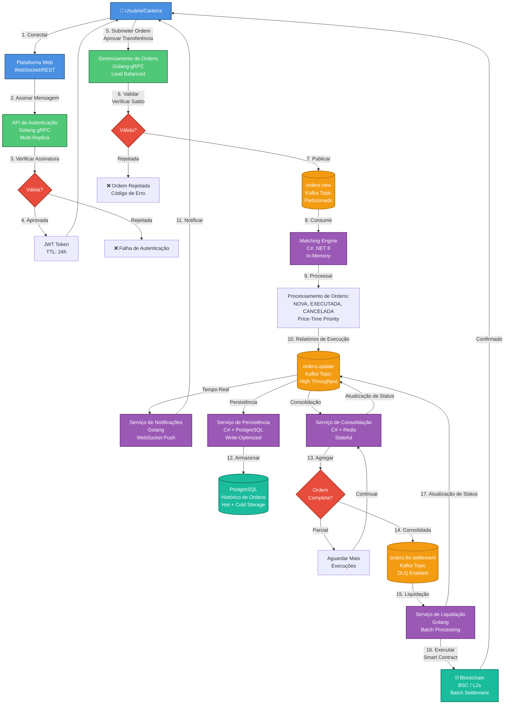

# Arquitetura do Fluxo de Submissão e Execução de Ordens

## Visão Geral Executiva

Este documento especifica a arquitetura técnica do sistema de submissão, execução e liquidação de ordens da Hymple Exchange. A plataforma implementa uma arquitetura híbrida de alto desempenho que combina a eficiência operacional de exchanges centralizadas (CEX) com a soberania e transparência de exchanges descentralizadas (DEX).

**Princípios Arquiteturais:**
- **Ultra-baixa latência**: <10ms para acknowledgment de ordens
- **Alta disponibilidade**: 99.99% uptime SLA
- **Escalabilidade horizontal**: Capacidade para >100.000 TPS
- **Event-driven & loosely coupled**: Resiliência e independência de serviços
- **Auditabilidade completa**: Trilha de auditoria imutável para compliance

## Diagrama Arquitetural



## Componentes do Sistema

### 1. **Camada de Autenticação**

**Serviço**: `hymple.exchange.auth`  
**Stack Tecnológico**: Golang 1.22+, gRPC, Redis (session cache)  
**Estratégia de Deploy**: Kubernetes Deployment com HPA (Horizontal Pod Autoscaler)

#### Funcionalidades
- Validação de assinaturas criptográficas de carteiras (ECDSA secp256k1)
- Emissão de tokens JWT (HS256) com claims customizados
- Rate limiting por endereço IP e carteira
- Detecção de replay attacks através de nonces
- Suporte a múltiplos provedores de carteira (MetaMask, WalletConnect, etc.)

#### Métricas de Performance
- **Latência P99**: <15ms
- **Throughput**: 50.000 req/s por réplica
- **Disponibilidade**: 99.99%
- **Réplicas mínimas**: 3 (produção)

#### Segurança
- Validação de assinatura off-chain
- Tokens com expiração configurável (default: 24h)
- Refresh tokens para sessões longas
- Blacklist de tokens comprometidos (Redis)
- Audit log de todas as autenticações

---

### 2. **API de Gerenciamento de Ordens**

**Serviço**: `hymple.exchange.orders`  
**Stack Tecnológico**: Golang 1.22+, gRPC, Protocol Buffers  
**Estratégia de Deploy**: Multi-AZ com load balancer (AWS ALB / GCP LB)

#### Funcionalidades
- Recepção e validação de ordens (LIMIT, MARKET, STOP-LIMIT, OCO)
- Validação de saldo em tempo real (integração com balance service)
- Pre-trade risk checks (exposure limits, daily limits)
- Order enrichment (timestamp, ordem ID, user context)
- Publicação em Kafka com garantia de entrega (acks=all)

#### Validações Pré-Execução
1. **Validação de Formato**: Schema validation (Protocol Buffers)
2. **Validação de Autenticação**: JWT verification e permissões
3. **Validação de Saldo**: Consulta ao balance service com cache
4. **Validação de Risco**: Limites por usuário e por par de trading
5. **Validação de Mercado**: Verificação de trading pair ativo
6. **Validação de Preço**: Price collar checks (±10% do último preço)

#### Métricas de Performance
- **Latência P99**: <10ms (pre-kafka publish)
- **Throughput**: 100.000 ordens/s (agregado)
- **Taxa de rejeição**: <0.1% (ordens válidas)
- **Disponibilidade**: 99.99%

#### Códigos de Erro (RFC 7807)
- `ORD-001`: Formato de ordem inválido
- `ORD-002`: Saldo insuficiente
- `ORD-003`: Par de trading inválido ou inativo
- `ORD-004`: Preço fora do collar permitido
- `ORD-005`: Quantidade abaixo do mínimo
- `ORD-006`: Limite de exposição excedido
- `ORD-007`: Rate limit excedido

---

### 3. **Matching Engine (Order Book)**

**Serviço**: `hymple.exchange.order.book`  
**Stack Tecnológico**: C# .NET 8, In-Memory Data Structures  
**Estratégia de Deploy**: Instâncias dedicadas por ativo ou grupo de ativos

#### Arquitetura do Matching Engine

##### Algoritmo de Matching
- **Price-Time Priority**: Melhor preço primeiro, mesmo preço = primeiro a chegar
- **Estrutura de dados**: Red-Black Trees para order books (O(log n) insert/delete)
- **Execução determinística**: Ordem de processamento garantida
- **Partial fills**: Suporte completo a execuções parciais
- **Fill-or-Kill (FOK)**: Execução completa ou cancelamento
- **Immediate-or-Cancel (IOC)**: Execução parcial imediata

##### Tipos de Ordem Suportados
- **LIMIT**: Ordem com preço específico
- **MARKET**: Execução imediata ao melhor preço disponível
- **STOP-LOSS**: Ordem ativada quando preço atinge trigger
- **STOP-LIMIT**: Stop-loss com limite de preço
- **OCO (One-Cancels-Other)**: Duas ordens linkadas
- **Trailing Stop**: Stop loss dinâmico

##### Estados de Ordem
1. **NEW**: Ordem aceita e inserida no book
2. **PARTIALLY_FILLED**: Execução parcial em andamento
3. **FILLED**: Ordem completamente executada
4. **CANCELED**: Ordem cancelada pelo usuário
5. **REJECTED**: Ordem rejeitada pelo sistema
6. **EXPIRED**: Ordem expirada (GTC, GTD)

#### Métricas de Performance
- **Latência de Matching**: <1ms (P99)
- **Throughput**: 1.000.000 matches/s por instância
- **Capacity**: 500.000 ordens ativas simultâneas por book
- **Market depth updates**: >1000 updates/s

#### Otimizações
- Lock-free data structures onde possível
- Zero-allocation hot paths
- Memory pooling para objetos frequentes
- NUMA-aware memory allocation
- CPU pinning para threads críticas

---

### 4. **Serviços Event-Driven**

#### 4.1 Serviço de Notificações

**Serviço**: `hymple.exchange.orders.notification`  
**Stack Tecnológico**: Golang, WebSocket, Server-Sent Events (SSE)

##### Funcionalidades
- Conexões WebSocket persistentes com heartbeat
- Broadcasting de updates de ordens em tempo real
- Suporte a múltiplos dispositivos por usuário
- Fallback para SSE em ambientes restritos
- Compressão de mensagens (gzip, brotli)
- Filtros de subscrição customizáveis

##### Métricas
- **Latência de entrega**: <5ms (P95)
- **Conexões simultâneas**: 100.000+ por instância
- **Taxa de mensagens**: 1.000.000 msgs/s (agregado)
- **Taxa de reconexão**: <2% (em condições normais)

---

#### 4.2 Serviço de Persistência

**Serviço**: `hymple.exchange.orders.persistence`  
**Stack Tecnológico**: C# .NET 8, MySQL 8.0

##### Funcionalidades
- Persistência de todos os eventos de ordem (event sourcing)
- Armazenamento de execution reports
- Histórico de trades (hot storage: 90 dias, cold storage: infinito)
- Indexação otimizada para queries comuns
- Particionamento por range temporal
- Backup contínuo e point-in-time recovery

##### Schema de Dados
```sql
-- Tabela de ordens (time-series)
orders (
  order_id UUID PRIMARY KEY,
  user_id UUID NOT NULL,
  symbol VARCHAR(20) NOT NULL,
  side ENUM('BUY', 'SELL'),
  type ENUM('LIMIT', 'MARKET', 'STOP_LIMIT'),
  status VARCHAR(20),
  price NUMERIC(20,8),
  quantity NUMERIC(20,8),
  filled_quantity NUMERIC(20,8),
  created_at TIMESTAMPTZ,
  updated_at TIMESTAMPTZ
)

-- Tabela de execuções
executions (
  execution_id UUID PRIMARY KEY,
  order_id UUID REFERENCES orders(order_id),
  price NUMERIC(20,8),
  quantity NUMERIC(20,8),
  fee NUMERIC(20,8),
  executed_at TIMESTAMPTZ
)
```

##### Métricas
- **Write throughput**: 50.000 writes/s
- **Latência de escrita**: <10ms (P99)
- **Retention**: Hot (90d), Warm (1y), Cold (infinito)
- **Backup RPO**: <1 minuto

---

#### 4.3 Serviço de Consolidação

**Serviço**: `hymple.exchange.orders.consolidator`  
**Stack Tecnológico**: C# .NET 8, Redis (state management)

##### Funcionalidades
- Agregação de execuções parciais por ordem
- Cálculo de preço médio ponderado (VWAP)
- Detecção de ordens completamente preenchidas
- Geração de relatórios consolidados para settlement
- Retry logic com exponential backoff
- Idempotency garantida

##### Lógica de Consolidação
```
Para cada ordem:
  1. Agregar todas as execuções
  2. Calcular filled_quantity total
  3. Calcular preço médio ponderado
  4. Calcular fees totais
  5. Se filled_quantity == order_quantity:
     -> Marcar como FILLED
     -> Publicar em orders.for.settlement
  6. Caso contrário:
     -> Aguardar mais execuções
```

##### Métricas
- **Latência de consolidação**: <20ms (P95)
- **Throughput**: 50.000 consolidações/s
- **Taxa de erro**: <0.01%

---

#### 4.4 Serviço de Liquidação

**Serviço**: `hymple.exchange.orders.settlement`  
**Stack Tecnológico**: Golang, Web3, Smart Contracts (Solidity)

##### Funcionalidades
- Execução de liquidação on-chain via smart contracts
- Batch settlement para otimização de gas
- Retry automático em caso de falhas de rede
- Suporte multi-chain (BSC, Arbitrum, Optimism, Base)
- Monitoring de confirmações de blockchain
- Reconciliação entre saldo off-chain e on-chain

##### Processo de Liquidação
1. **Agregação**: Agrupar ordens por usuário e ativo
2. **Batch creation**: Criar lote de até 100 ordens
3. **Gas estimation**: Estimar gas necessário
4. **Transaction submission**: Enviar transação para blockchain
5. **Confirmation monitoring**: Aguardar confirmações (12 blocos)
6. **Status update**: Publicar status final

##### Otimizações de Gas
- Batch settlement reduz custos em ~80%
- EIP-2930 access lists
- Otimização de storage slots
- Uso de eventos em vez de storage para logs

##### Métricas
- **Latência de settlement**: <30 segundos (BSC)
- **Custo médio de gas**: <$0.50 por lote
- **Taxa de sucesso**: >99.9%
- **Throughput**: 10.000 settlements/minuto

---

### 5. **Message Broker (Apache Kafka)**

**Stack Tecnológico**: Apache Kafka 3.6+, Zookeeper/KRaft  
**Estratégia de Deploy**: Cluster multi-AZ com replicação

#### Tópicos e Configurações

##### `orders.new`
- **Partições**: 50 (particionamento por symbol hash)
- **Replication factor**: 3
- **Retention**: 7 dias
- **Compression**: lz4
- **Min in-sync replicas**: 2

##### `orders.update`
- **Partições**: 100 (particionamento por order_id hash)
- **Replication factor**: 3
- **Retention**: 30 dias
- **Compression**: snappy
- **Min in-sync replicas**: 2

##### `orders.for.settlement`
- **Partições**: 20
- **Replication factor**: 3
- **Retention**: 90 dias (compliance)
- **Compression**: gzip
- **Min in-sync replicas**: 3 (critical)

#### Garantias de Entrega
- **Producer**: acks=all, retries=∞, idempotent=true
- **Consumer**: Offset management manual, exactly-once semantics
- **Dead Letter Queue (DLQ)**: Para mensagens com falha após N retries

#### Métricas de Cluster
- **Throughput**: 10GB/s (agregado)
- **Latência**: <10ms (P99)
- **Disponibilidade**: 99.99%
- **Messages/s**: 5.000.000+

---

## Fluxo Detalhado de Execução

### Fase 1: Autenticação (Passos 1-4)

**Tempo total**: ~50ms

1. **Conexão da Carteira** (10ms)
   - Usuário conecta carteira via WalletConnect ou injeção
   - Plataforma solicita acesso à conta
   
2. **Assinatura de Mensagem** (20ms)
   - Plataforma gera challenge único (nonce)
   - Usuário assina mensagem com chave privada
   - Formato: EIP-191 ou EIP-712
   
3. **Verificação de Assinatura** (10ms)
   - API de autenticação recupera endereço público
   - Valida que assinatura corresponde ao endereço
   - Verifica nonce não foi usado (replay protection)
   
4. **Emissão de Token** (10ms)
   - Gera JWT com claims: user_id, wallet_address, roles
   - Armazena em cache Redis para validação rápida
   - Retorna token ao cliente (TTL: 24h)

---

### Fase 2: Submissão de Ordem (Passos 5-7)

**Tempo total**: ~15ms

5. **Submissão da Ordem** (<1ms)
   - Cliente envia ordem via gRPC
   - Payload: symbol, side, type, price, quantity, timeInForce
   - Aprovação de transferência (se primeira ordem): permit/approve
   
6. **Validação e Verificação** (10ms)
   - **Validação JWT**: Verifica autenticidade e expiração (1ms)
   - **Validação de schema**: Protocol Buffers validation (0.5ms)
   - **Verificação de saldo**: Cache-aside pattern com Redis (2ms)
   - **Risk checks**: Limites de exposição e daily limits (2ms)
   - **Price collar**: Validação de preço razoável (0.5ms)
   - **Geração de order ID**: UUID v7 (time-ordered) (0.5ms)
   
7. **Publicação no Kafka** (4ms)
   - Serialização para Protocol Buffers (0.5ms)
   - Envio ao tópico `orders.new` com acks=all (3ms)
   - Retorno de acknowledgment ao cliente (0.5ms)

**Códigos de Resposta**:
- `200 OK`: Ordem aceita
- `400 Bad Request`: Validação falhou
- `401 Unauthorized`: Token inválido
- `429 Too Many Requests`: Rate limit
- `503 Service Unavailable`: Sistema indisponível

---

### Fase 3: Processamento de Ordem (Passos 8-10)

**Tempo total**: ~2ms

8. **Consumo do Kafka** (0.5ms)
   - Matching engine consome mensagem do tópico `orders.new`
   - Deserialização de Protocol Buffers
   - Roteamento para order book específico (por symbol)
   
9. **Matching Engine** (1ms)
   - **Inserção no book**: Red-Black Tree insertion (O(log n))
   - **Matching loop**: Busca por ordens compatíveis
     - Para BUY: Buscar melhor ASK (menor preço)
     - Para SELL: Buscar melhor BID (maior preço)
   - **Execução**: Criar execution reports para cada match
   - **Atualização de estado**: Modificar quantidade preenchida
   
10. **Publicação de Execution Reports** (0.5ms)
    - Gerar relatórios de execução (JSON ou Protobuf)
    - Publicar em `orders.update` topic
    - Broadcast para todos os consumidores interessados

**Tipos de Execution Reports**:
- `ORDER_NEW`: Ordem aceita no book
- `ORDER_TRADE`: Execução total ou parcial
- `ORDER_CANCEL`: Cancelamento processado
- `ORDER_REJECT`: Rejeição pelo matching engine
- `ORDER_EXPIRE`: Ordem expirada

---

### Fase 4: Distribuição de Eventos (Passos 11-13)

**Tempo total (paralelo)**: ~20ms

11. **Notificação em Tempo Real** (5ms)
    - Serviço de notificações consome `orders.update`
    - Identifica conexões WebSocket ativas do usuário
    - Serializa mensagem (JSON compacto)
    - Push via WebSocket para todos os dispositivos
    - Cliente atualiza UI instantaneamente
    
12. **Persistência em Banco de Dados** (10ms)
    - Serviço de persistência consome `orders.update`
    - Batch insert em MySQL (lotes de 100 mensagens)
    - Atualização de índices
    - Escrita em InnoDB redo log
    - Replicação para standby servers
    
13. **Consolidação** (20ms)
    - Serviço de consolidação consome `orders.update`
    - Carrega estado atual da ordem do Redis
    - Agrega nova execução ao estado
    - Calcula VWAP (Volume Weighted Average Price)
    - Se ordem completa → publica em `orders.for.settlement`
    - Caso contrário → atualiza estado e aguarda

---

### Fase 5: Liquidação On-Chain (Passos 14-17)

**Tempo total**: ~30 segundos (dependente da blockchain)

14. **Preparação para Settlement** (100ms)
    - Consolidador identifica ordem completamente preenchida
    - Calcula net positions (por usuário e ativo)
    - Agrupa ordens em batch (até 100 ordens)
    - Publica lote em `orders.for.settlement`
    
15. **Processamento de Settlement** (5s)
    - Serviço de settlement consome mensagem
    - Valida integridade dos dados
    - Estima gas necessário (eth_estimateGas)
    - Ajusta gas price baseado em network conditions
    - Constrói transação com batch de settlements
    
16. **Execução na Blockchain** (25s)
    - Assina transação com hot wallet (HSM-protected)
    - Submete transação para blockchain (BSC/L2)
    - Aguarda inclusão em bloco (~3s)
    - Aguarda confirmações (12 blocos ~36s BSC, ~12s L2)
    - Lê eventos emitidos pelo smart contract
    
17. **Atualização Final de Status** (500ms)
    - Publica evento de settlement confirmado em `orders.update`
    - Atualiza status da ordem para `SETTLED`
    - Notifica usuário via WebSocket
    - Persiste hash da transação e receipt
    - Atualiza saldo on-chain do usuário

**Estados de Settlement**:
- `PENDING`: Aguardando processamento
- `SUBMITTED`: Transação enviada para blockchain
- `CONFIRMING`: Aguardando confirmações
- `CONFIRMED`: Settlement confirmado
- `FAILED`: Falha no settlement (retry automático)

---

## Padrões Arquiteturais Enterprise

### 1. Microserviços com Domain-Driven Design (DDD)

Cada serviço é responsável por um bounded context específico:
- **Auth Context**: Autenticação e autorização
- **Order Context**: Lifecycle de ordens
- **Matching Context**: Execução de trades
- **Settlement Context**: Liquidação on-chain
- **Notification Context**: Comunicação em tempo real

### 2. Event Sourcing & CQRS

**Event Sourcing**:
- Todos os eventos são armazenados como log imutável
- Estado atual é derivado do replay de eventos
- Auditoria completa e temporal queries

**CQRS (Command Query Responsibility Segregation)**:
- **Command Side**: APIs de submissão (Write)
- **Query Side**: APIs de consulta (Read)
- Modelos de dados otimizados separadamente
- Eventual consistency entre write e read models

### 3. Saga Pattern para Transações Distribuídas

Implementado para fluxos que envolvem múltiplos serviços:

**Exemplo: Order Submission Saga**
1. Reservar saldo → Success/Fail
2. Criar ordem no book → Success/Compensate(1)
3. Persistir ordem → Success/Compensate(1,2)
4. Notificar usuário → Best effort

**Compensação em caso de falha**:
- Rollback automático de operações anteriores
- Logs de compensação para debugging
- Alertas para operações que requerem intervenção manual

### 4. Circuit Breaker Pattern

Proteção contra cascatas de falhas:

```
Estados do Circuit Breaker:
- CLOSED: Operação normal
- OPEN: Falhas detectadas, rejeitar requisições
- HALF_OPEN: Teste de recuperação

Thresholds:
- Failure rate: >5% em 10s
- Timeout: >1s (P95)
- Recovery: 30s em estado OPEN
```

### 5. API Gateway Pattern

**Gateway unificado** para todos os serviços:
- Rate limiting global e por usuário
- Autenticação centralizada (JWT validation)
- Request/Response logging
- Metrics aggregation
- Protocol translation (REST → gRPC)

---

## Stack Tecnológico Completo

| Componente | Tecnologia | Justificativa |
|------------|-----------|---------------|
| **APIs de Entrada** | Golang 1.22+ | Alta concorrência, baixa latência |
| **Matching Engine** | C# .NET 8 | Performance, tipagem forte, tooling |
| **Message Broker** | Apache Kafka 3.6 | Throughput massivo, durabilidade |
| **Cache Distribuído** | Redis 7.x (Cluster) | Sub-millisecond latency, pub/sub |
| **Banco de Dados** | MySQL 8.0 (InnoDB) | ACID, alta performance, replicação |
| **Orquestração** | Kubernetes 1.28+ | Auto-scaling, self-healing |
| **Service Mesh** | Istio / Linkerd | mTLS, observability, traffic management |
| **Monitoring** | Prometheus + Grafana | Métricas e visualização |
| **Logging** | ELK Stack (Elasticsearch, Logstash, Kibana) | Logs centralizados |
| **Tracing** | Jaeger / Tempo | Distributed tracing |
| **Blockchain** | Web3.js / Ethers.js | Interação com smart contracts |
| **Load Balancer** | AWS ALB / GCP LB | Distribuição de tráfego |
| **CDN** | CloudFlare | Edge caching, DDoS protection |

---

## Métricas de Performance (SLA)

### Latência End-to-End

| Operação | P50 | P95 | P99 | P99.9 |
|----------|-----|-----|-----|-------|
| Autenticação | 20ms | 40ms | 50ms | 80ms |
| Submissão de ordem | 8ms | 12ms | 15ms | 25ms |
| Matching | 0.5ms | 0.8ms | 1ms | 2ms |
| Notificação WS | 2ms | 4ms | 5ms | 10ms |
| Persistência DB | 5ms | 8ms | 10ms | 20ms |
| Settlement on-chain | 20s | 30s | 45s | 60s |

### Throughput

| Componente | Throughput |
|------------|-----------|
| Order API | 100.000 req/s (agregado) |
| Matching Engine | 1.000.000 matches/s por instância |
| Kafka Cluster | 5.000.000 msg/s |
| WebSocket Server | 100.000 conexões/instância |
| Database Writes | 50.000 writes/s |

### Disponibilidade

| Serviço | SLA | Downtime Mensal |
|---------|-----|-----------------|
| Order API | 99.99% | 4.32 minutos |
| Matching Engine | 99.95% | 21.6 minutos |
| Settlement Service | 99.9% | 43.2 minutos |
| Overall System | 99.95% | 21.6 minutos |

---

## Segurança Enterprise

### 1. Autenticação e Autorização

- **mTLS** entre todos os microserviços
- **JWT** com rotação automática de secrets
- **RBAC** (Role-Based Access Control) granular
- **API Keys** para integrações de terceiros
- **Rate limiting** adaptativo baseado em ML

### 2. Proteção de Dados

- **Encryption at rest**: AES-256 (database, backups)
- **Encryption in transit**: TLS 1.3
- **PII masking**: Logs não contêm dados sensíveis
- **Key management**: AWS KMS / HashiCorp Vault
- **Secret rotation**: Automática a cada 90 dias

### 3. Segurança de Smart Contracts

- **Multi-sig wallets** para operações críticas
- **Time-locks** para upgrades de contratos
- **Pausable contracts** para emergências
- **Reentrancy guards** em todas as funções payable
- **Auditorias periódicas** (CertiK, Trail of Bits, OpenZeppelin)

### 4. Detecção de Anomalias

- **ML models** para detecção de wash trading
- **Behavioral analysis** para identificar bots maliciosos
- **Pattern matching** para front-running attempts
- **Alertas em tempo real** para atividades suspeitas

---

## Disaster Recovery & Business Continuity

### Estratégia de Backup

**Bancos de Dados**:
- Full backup: Diário às 00:00 UTC
- Incremental backup: A cada hora
- Point-in-time recovery: Até 30 dias atrás
- Replicação cross-region: Síncrona (DR site)

**Kafka**:
- Replicação de tópicos: Factor 3 (multi-AZ)
- Backup de configurações: Git (Infrastructure as Code)
- Disaster recovery cluster: Região secundária (standby)

### Failover Automático

**Database**:
- MySQL Group Replication (multi-primary)
- Automatic failover com orchestrator
- RTO: <60 segundos
- RPO: <10 segundos

**Serviços**:
- Health checks contínuos (readiness, liveness)
- Auto-healing: Kubernetes restart unhealthy pods
- Circuit breakers: Isolar serviços com falha
- Graceful degradation: Funcionalidade reduzida vs. downtime total

### RTO & RPO Targets

| Componente | RTO | RPO |
|------------|-----|-----|
| Order API | 1 minuto | 0 (stateless) |
| Matching Engine | 5 minutos | <10 segundos |
| Database | 1 minuto | <10 segundos |
| Settlement | 10 minutos | 0 (blockchain é source of truth) |

---

## Compliance e Auditoria

### Trilha de Auditoria

**Eventos auditados**:
- Todas as autenticações (sucesso e falha)
- Submissões de ordem (aceitas e rejeitadas)
- Execuções de trade (com timestamps precisos)
- Cancelamentos e modificações
- Settlements on-chain (com TX hashes)
- Acessos administrativos

**Formato de logs**:
```json
{
  "timestamp": "2026-01-31T10:30:00.123Z",
  "event_type": "ORDER_SUBMITTED",
  "user_id": "uuid",
  "wallet_address": "0x...",
  "order_id": "uuid",
  "symbol": "ETHUSDT",
  "side": "BUY",
  "quantity": "1.5",
  "price": "2800.50",
  "ip_address": "masked",
  "user_agent": "masked"
}
```

### Retenção de Dados

| Tipo de Dado | Hot Storage | Cold Storage | Total |
|--------------|-------------|--------------|-------|
| Ordens ativas | 90 dias | - | 90 dias |
| Histórico de trades | 1 ano | 7 anos | 8 anos |
| Audit logs | 1 ano | Permanente | ∞ |
| Settlements | 2 anos | Permanente | ∞ |

### Relatórios Regulatórios

- **Trade reporting**: Export diário em formato FIX/CSV
- **AML screening**: Integração com providers (Chainalysis, Elliptic)
- **Suspicious activity reports**: Alertas automáticos para compliance team
- **Jurisdictional compliance**: Adaptável por região

---

## Observabilidade

### Métricas (Prometheus)

**Golden Signals**:
- **Latency**: Histogramas P50, P95, P99, P99.9
- **Traffic**: Request rate (req/s)
- **Errors**: Error rate e error types
- **Saturation**: CPU, Memory, Disk, Network

**Métricas de Negócio**:
- Ordens por segundo (total, por symbol)
- Volume de trading (USD, por symbol)
- Taxa de rejeição de ordens
- Tempo médio de settlement
- Custo médio de gas

### Logs (ELK Stack)

**Structured logging** em JSON:
- Correlation IDs para tracing end-to-end
- Log levels: DEBUG, INFO, WARN, ERROR, FATAL
- Sampling: 100% para ERROR+, 10% para INFO, 1% para DEBUG (produção)

### Tracing (Jaeger)

**Distributed tracing** para cada requisição:
- Spans para cada operação (API call, DB query, Kafka publish)
- Baggage propagation para context sharing
- Sampling rate: 1% (produção), 100% (dev)

### Alertas

**Alertmanager** com integração Slack/PagerDuty:

**Severidade CRITICAL (P1)**:
- API availability <99% (5min window)
- Error rate >5% (1min window)
- Latency P99 >100ms (5min window)
- Database replication lag >30s

**Severidade HIGH (P2)**:
- Kafka consumer lag >10.000 mensagens
- Disk usage >85%
- Memory usage >90%
- Settlement failures >1% (15min window)

**Severidade MEDIUM (P3)**:
- Certificate expiration <7 dias
- Backup failures
- Anomalous trading patterns detected

---

## Conclusão

A arquitetura da Hymple Exchange foi projetada seguindo os mais altos padrões da indústria, combinando:

✅ **Performance**: Latência sub-10ms, throughput de 100k+ TPS  
✅ **Escalabilidade**: Horizontalmente escalável, multi-region ready  
✅ **Resiliência**: Failover automático, disaster recovery  
✅ **Segurança**: Defense in depth, auditorias regulares  
✅ **Observabilidade**: Metrics, logs, traces integrados  
✅ **Compliance**: Audit trails, regulatory reporting ready  

Esta arquitetura híbrida estabelece um novo paradigma no mercado, oferecendo a performance de exchanges centralizadas com a transparência e auto-custódia de soluções descentralizadas.

---

**Versão do Documento**: 2.0  
**Última Atualização**: 31 de Janeiro de 2026  
**Arquitetura**: Hymple Exchange - Order Flow (Professional Edition)  
**Status**: ✅ Produção
