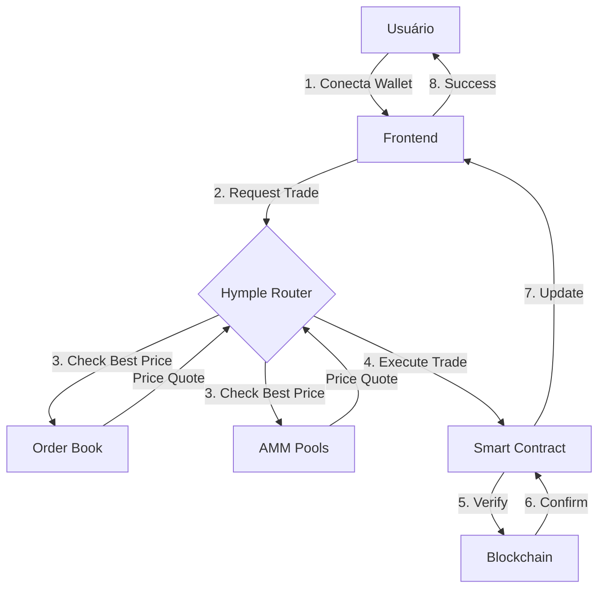
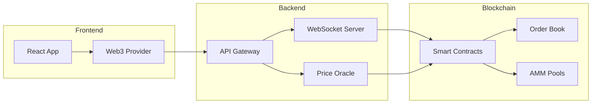
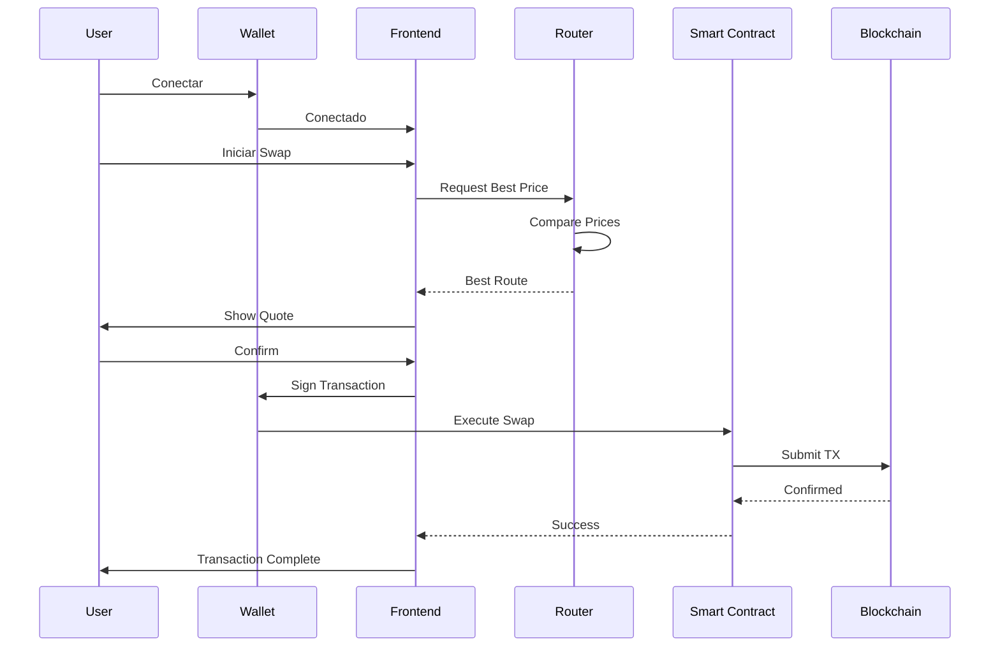

# 🎨 Guia de Componentes Visuais

Este guia mostra todos os componentes visuais disponíveis para criar um whitepaper profissional.

---

## 1. Cards de Navegação Personalizados

<div class="nav-cards">
  <a href="#" class="nav-card">
    <div class="nav-card-header">
      <span class="nav-card-icon">📘</span>
      WHITEPAPER
    </div>
    <h3 class="nav-card-title">Introduction</h3>
    <p class="nav-card-description">Descubra a visão e missão do Hymple</p>
  </a>
  
  <a href="#" class="nav-card">
    <div class="nav-card-header">
      <span class="nav-card-icon">🔄</span>
      TECNOLOGIA
    </div>
    <h3 class="nav-card-title">Hybrid Architecture</h3>
    <p class="nav-card-description">Nossa abordagem híbrida inovadora</p>
  </a>
  
  <a href="#" class="nav-card">
    <div class="nav-card-header">
      <span class="nav-card-icon">🚀</span>
      ROADMAP
    </div>
    <h3 class="nav-card-title">Future Plans</h3>
    <p class="nav-card-description">O que vem a seguir para o Hymple</p>
  </a>
</div>

---

## 2. Badges e Tags Crypto

Destaque termos e conceitos importantes:

<span class="crypto-badge">Web3</span>
<span class="crypto-badge">DeFi</span>
<span class="crypto-badge">Hybrid DEX</span>
<span class="crypto-badge">Layer 2</span>
<span class="crypto-badge">Cross-Chain</span>
<span class="crypto-badge">Zero-Knowledge</span>

---

## 3. Feature Grid

<div class="feature-grid">
  <div class="feature-card">
    <div class="feature-icon">⚡</div>
    <h3 class="feature-title">Ultra-Fast</h3>
    <p class="feature-description">Transações instantâneas com latência mínima para a melhor experiência do usuário</p>
  </div>
  
  <div class="feature-card">
    <div class="feature-icon">🔒</div>
    <h3 class="feature-title">Seguro</h3>
    <p class="feature-description">Segurança de nível bancário com custódia descentralizada e auditorias regulares</p>
  </div>
  
  <div class="feature-card">
    <div class="feature-icon">🌐</div>
    <h3 class="feature-title">Cross-Chain</h3>
    <p class="feature-description">Negocie em múltiplas blockchains sem complicações, tudo em uma interface</p>
  </div>
  
  <div class="feature-card">
    <div class="feature-icon">💰</div>
    <h3 class="feature-title">Low Fees</h3>
    <p class="feature-description">Taxas ultra-competitivas que maximizam seus lucros em cada transação</p>
  </div>
  
  <div class="feature-card">
    <div class="feature-icon">🔐</div>
    <h3 class="feature-title">Non-Custodial</h3>
    <p class="feature-description">Você mantém o controle total de seus ativos, sempre</p>
  </div>
  
  <div class="feature-card">
    <div class="feature-icon">📊</div>
    <h3 class="feature-title">Advanced Trading</h3>
    <p class="feature-description">Ferramentas profissionais para traders de todos os níveis</p>
  </div>
</div>

---

## 4. Admonitions (Callouts)

### Nota Informativa
!!! note "Importante Saber"
    Este é um callout informativo para destacar informações importantes que os usuários devem conhecer.

### Dica Profissional
!!! tip "Pro Tip 💡"
    Use este tipo de callout para compartilhar dicas valiosas e melhores práticas com seus leitores.

### Aviso Importante
!!! warning "Atenção ⚠️"
    Alertas devem ser usados para informações que requerem atenção especial dos usuários.

### Sucesso
!!! success "Implementado ✅"
    Use este callout para destacar recursos implementados ou conquistas alcançadas.

### Perigo/Crítico
!!! danger "Crítico 🚨"
    Informações críticas que podem impactar significativamente devem usar este tipo de callout.

### Informação Adicional
!!! info "Saiba Mais 📚"
    Forneça contexto adicional e informações complementares com este callout.

---

## 5. Tabelas Profissionais

### Comparação de Features

| Feature | Hymple | Traditional DEX | CEX |
|---------|:------:|:---------------:|:---:|
| **Velocidade** | ⚡⚡⚡ | 🐌 | ⚡⚡ |
| **Taxas** | 💰 0.1% | 💰💰 0.3% | 💰💰💰 0.5% |
| **Segurança** | 🔒🔒🔒 | 🔒🔒 | 🔒 |
| **Custódia** | ✅ Self | ✅ Self | ❌ Centralized |
| **KYC/AML** | ⚡ Optional | ❌ None | ✅✅ Required |
| **Liquidez** | 💎💎💎 | 💎💎 | 💎💎💎 |

### Roadmap

| Trimestre | Milestone | Status |
|-----------|-----------|--------|
| Q1 2025 | Smart Contracts Audit | ✅ Completo |
| Q1 2025 | Testnet Launch | ✅ Completo |
| Q2 2025 | Mainnet Launch | 🚧 Em Progresso |
| Q2 2025 | Mobile App | 📅 Planejado |
| Q3 2025 | DAO Governance | 📅 Planejado |
| Q4 2025 | Layer 2 Integration | 💡 Futuro |

---

## 6. Code Blocks com Syntax Highlighting

### Solidity - Smart Contract

```solidity
// SPDX-License-Identifier: MIT
pragma solidity ^0.8.20;

import "@openzeppelin/contracts/token/ERC20/ERC20.sol";

contract HympleToken is ERC20 {
    uint256 public constant MAX_SUPPLY = 1_000_000_000 * 10**18;
    
    constructor() ERC20("Hymple", "HYM") {
        _mint(msg.sender, MAX_SUPPLY);
    }
    
    function burn(uint256 amount) external {
        _burn(msg.sender, amount);
    }
}
```

### TypeScript - Frontend

```typescript
import { ethers } from 'ethers';

interface TradeParams {
  tokenIn: string;
  tokenOut: string;
  amountIn: bigint;
  slippage: number;
}

async function executeTrade(params: TradeParams): Promise<string> {
  const provider = new ethers.BrowserProvider(window.ethereum);
  const signer = await provider.getSigner();
  
  // Calcular preço com slippage
  const amountOutMin = calculateMinOutput(
    params.amountIn,
    params.slippage
  );
  
  // Executar trade
  const tx = await contract.swap(
    params.tokenIn,
    params.tokenOut,
    params.amountIn,
    amountOutMin
  );
  
  return tx.hash;
}
```

### Python - Backend/Analytics

```python
import pandas as pd
import numpy as np
from web3 import Web3

class LiquidityAnalyzer:
    def __init__(self, rpc_url: str):
        self.w3 = Web3(Web3.HTTPProvider(rpc_url))
        
    def calculate_pool_metrics(self, pool_address: str) -> dict:
        """Calcular métricas de liquidez do pool"""
        # Obter reservas do pool
        reserves = self.get_reserves(pool_address)
        
        # Calcular TVL
        tvl = self.calculate_tvl(reserves)
        
        # Calcular APY
        apy = self.calculate_apy(pool_address)
        
        return {
            'tvl': tvl,
            'apy': apy,
            'volume_24h': self.get_volume_24h(pool_address),
            'fees_24h': self.get_fees_24h(pool_address)
        }
```

### Rust - Smart Contract (CosmWasm)

```rust
use cosmwasm_std::{
    entry_point, to_binary, Binary, Deps, DepsMut, 
    Env, MessageInfo, Response, StdResult
};

#[entry_point]
pub fn execute(
    deps: DepsMut,
    _env: Env,
    info: MessageInfo,
    msg: ExecuteMsg,
) -> StdResult<Response> {
    match msg {
        ExecuteMsg::Swap {
            token_in,
            token_out,
            amount_in,
        } => execute_swap(deps, info, token_in, token_out, amount_in),
        ExecuteMsg::AddLiquidity {
            token_a,
            token_b,
            amount_a,
            amount_b,
        } => execute_add_liquidity(deps, info, token_a, token_b, amount_a, amount_b),
    }
}
```

---

## 7. Tabs de Conteúdo

=== "Comprar"
    ### Como Comprar Tokens
    
    1. **Conecte sua Wallet**
       - MetaMask, WalletConnect ou Coinbase Wallet
    
    2. **Selecione o Token**
       - Escolha o token que deseja comprar
    
    3. **Insira o Valor**
       - Digite a quantidade desejada
    
    4. **Confirme a Transação**
       - Revise as taxas e confirme

=== "Vender"
    ### Como Vender Tokens
    
    1. **Selecione o Token**
       - Escolha o token que deseja vender
    
    2. **Insira a Quantidade**
       - Digite quanto deseja vender
    
    3. **Revise a Cotação**
       - Verifique o preço e slippage
    
    4. **Execute a Venda**
       - Confirme a transação na wallet

=== "Prover Liquidez"
    ### Como Prover Liquidez
    
    1. **Escolha o Par**
       - Selecione os dois tokens do pool
    
    2. **Adicione Liquidez**
       - Insira os valores proporcionais
    
    3. **Receba LP Tokens**
       - Tokens de liquidez como recibo
    
    4. **Ganhe Recompensas**
       - Receba fees das transações

=== "Stake"
    ### Como Fazer Staking
    
    1. **Obtenha LP Tokens**
       - Forneça liquidez primeiro
    
    2. **Stake LP Tokens**
       - Deposite no contrato de staking
    
    3. **Ganhe HYM**
       - Receba recompensas em tokens HYM
    
    4. **Compound ou Retirar**
       - Reinvista ou retire quando quiser

---

## 8. Diagramas Mermaid

### Fluxo de Transação



### Arquitetura do Sistema



### Sequência de Swap



---

## 9. Fórmulas Matemáticas

### Fórmulas Inline

A fórmula do produto constante em AMM é \(x \times y = k\), onde \(x\) e \(y\) são as reservas dos tokens.

O preço de um token é calculado como \(P = \frac{y}{x}\).

### Fórmulas em Bloco

**Cálculo de Slippage:**

\[
Slippage = \frac{P_{expected} - P_{actual}}{P_{expected}} \times 100\%
\]

**Cálculo de Impermanent Loss:**

\[
IL = 2 \times \frac{\sqrt{r}}{1 + r} - 1
\]

Onde \(r\) é a razão de mudança de preço: \(r = \frac{P_{final}}{P_{initial}}\)

**Fórmula de Swap com Taxa:**

\[
y_{out} = \frac{y \times x_{in} \times (1 - fee)}{x + x_{in} \times (1 - fee)}
\]

**APY Composto:**

\[
APY = \left(1 + \frac{APR}{n}\right)^n - 1
\]

---

## 10. Listas e Checklists

### Roadmap do Projeto

- [x] ✅ Pesquisa de mercado
- [x] ✅ Design da arquitetura
- [x] ✅ Desenvolvimento dos smart contracts
- [x] ✅ Auditoria de segurança
- [x] ✅ Frontend MVP
- [ ] 🚧 Testnet pública
- [ ] 🚧 Integração com wallets
- [ ] 📅 Launch na mainnet
- [ ] 📅 Programa de incentivos
- [ ] 📅 Mobile app
- [ ] 💡 Governance (DAO)

### Funcionalidades

- [x] Spot trading
- [x] Limit orders
- [x] AMM integration
- [x] Liquidity pools
- [ ] Margin trading
- [ ] Perpetuals
- [ ] Options
- [ ] Lending/Borrowing

---

## 11. Citações e Destaques

> **"Hymple representa o futuro do DeFi, combinando o melhor dos dois mundos: a velocidade de exchanges centralizadas com a segurança da blockchain."**
> 
> — CEO, Hymple Labs

> 💡 **Dica de Design:** Use citações para destacar depoimentos, estatísticas importantes ou conceitos-chave do seu whitepaper.

---

## 12. Imagens e Mídia

### Imagens com Lightbox

Clique nas imagens para expandir (com GLightbox):


### Imagens Lado a Lado

<div style="display: grid; grid-template-columns: 1fr 1fr; gap: 1rem;">
  
  
</div>

---

## 13. Ícones e Emojis

### Emojis Nativos

🚀 💎 ⚡ 🔥 💰 📈 🎯 🌟 ✨ 💪 🏆 🎉 🔒 🌐 📊 💡 ⚙️ 🔧

### Material Icons

:material-rocket-launch: :material-shield-check: :material-currency-usd: :material-chart-line: :material-lightning-bolt:

---

## 14. Definições e Glossário

DeFi
: Decentralized Finance - Sistema financeiro descentralizado construído em blockchain

AMM
: Automated Market Maker - Protocolo que usa pools de liquidez para facilitar trades

TVL
: Total Value Locked - Valor total em USD depositado em um protocolo DeFi

---

## 15. Footnotes (Notas de Rodapé)

O Hymple usa um modelo híbrido[^1] que combina order book tradicional com AMM[^2].

[^1]: Um modelo híbrido oferece o melhor dos dois mundos: eficiência de preço e liquidez profunda.

[^2]: Automated Market Makers são protocolos que usam pools de liquidez ao invés de order books tradicionais.

---

## 🎨 Dicas de Design

!!! tip "Melhores Práticas"
    
    **Para um whitepaper profissional:**
    
    1. ✅ Use hierarquia visual clara (H1 > H2 > H3)
    2. ✅ Mantenha parágrafos curtos e escaneáveis
    3. ✅ Use listas para informações sequenciais
    4. ✅ Adicione diagramas para conceitos complexos
    5. ✅ Inclua exemplos de código quando relevante
    6. ✅ Use callouts para informações importantes
    7. ✅ Adicione badges para destacar tecnologias
    8. ✅ Mantenha consistência visual
    9. ✅ Use tabelas para comparações
    10. ✅ Inclua navegação clara entre seções

---

## 🚀 Próximos Passos

<div class="nav-cards">
  <a href="../introduction/" class="nav-card">
    <div class="nav-card-header">
      <span class="nav-card-icon">📖</span>
      COMEÇAR
    </div>
    <h3 class="nav-card-title">Leia o Whitepaper</h3>
    <p class="nav-card-description">Explore nossa visão e tecnologia</p>
  </a>
  
  <a href="../examples/" class="nav-card">
    <div class="nav-card-header">
      <span class="nav-card-icon">💻</span>
      RECURSOS
    </div>
    <h3 class="nav-card-title">Mais Exemplos</h3>
    <p class="nav-card-description">Veja mais recursos e componentes</p>
  </a>
</div>
