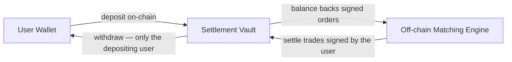

# Settlement & Withdrawals

> *How funds are held, settled, and withdrawn on Hymple*

Hymple's settlement model was designed around a single principle: **the user always keeps control of their funds**. This document describes exactly how that works in practice — how deposits are held, how trades are settled, and how withdrawals work in each available path.

The diagram below summarizes the flow of funds — the platform coordinates settlement but never takes possession of user funds:

---

### 1. The Settlement Vault

To trade on Hymple, the user deposits funds into a **smart contract** — the Hymple settlement vault.

The contract rules are simple and enforced on-chain:

- **Hymple cannot withdraw user funds.** The contract has no administrative withdrawal function in favor of the platform.
- **Only the depositing user can withdraw** their own balance.
- **Hymple can only settle trades** — and exclusively trades that were **signed by the user's wallet**. The user's signature is the cryptographic proof that authorizes each settlement.

This means the platform never takes possession of user funds. It operates as a settlement coordinator, not as a custodian.

### 2. Deposits

Depositing is a standard on-chain transaction from the user's wallet to the settlement vault:

1. The user connects their wallet and chooses the asset and amount.
2. The wallet requests confirmation for the deposit transaction.
3. Once confirmed on-chain, the balance becomes available for trading.

Deposits only require the standard network fee. Hymple charges no deposit fee.

### 3. Withdrawals via the Hymple Interface

Withdrawing through the Hymple interface is the recommended path:

- **Instant release** of funds.
- **Only the standard network fee applies** — Hymple charges no withdrawal fee.
- **No sanctions or delays**, even if the user has open orders on the book.

### 4. Direct On-Chain Withdrawals (Without Hymple)

The user can also withdraw directly through the blockchain, interacting with the settlement vault without depending on the Hymple interface. This guarantees that access to funds never depends on the platform's availability.

Two situations apply:

**4.1 No open orders on the book**

- The withdrawal is released **immediately**.
- The user pays **only the standard network fee**.

**4.2 Open orders on the book**

- The withdrawal can take **up to 30 minutes** to be released.
- In addition to the network fee, a **Hymple fee** applies, calculated based on the user's behavior history.

### 5. Why the Delay and Fee Exist

Open orders on Hymple's book are commitments backed by the user's deposited balance. If a user could instantly withdraw on-chain while keeping orders open, those orders could be matched **without funds available for settlement** — harming counterparties and market integrity.

The delay and the behavioral fee exist to discourage this abuse pattern. They are protective measures, not revenue mechanisms.

### 6. Anti-Abuse Sanctions

Users who repeatedly open orders and withdraw on-chain to avoid settlement may face progressive sanctions:

- **Withdrawal delay** (up to 30 minutes) when open orders exist;
- **Higher withdrawal fees**, scaled by behavior;
- **Reduction of account score**, affecting rewards and privileges;
- **Account restrictions** on the platform, in extreme and recurrent cases.

Sanctions are applied automatically, based on objective behavioral criteria, and are documented in the Anti-Manipulation and Anti-Abuse Protocols.

**Important:** sanctions never result in permanent seizure of funds. The user's ability to withdraw is always preserved — delays and fees are temporary and conditional protections, not confiscation.

### 7. Summary

| Action | Path | Release | Fees |
|---|---|---|---|
| Deposit | Wallet → settlement vault | On-chain confirmation | Network fee only |
| Withdraw | Hymple interface | Instant | Network fee only |
| Withdraw | Direct on-chain, no open orders | Immediate | Network fee only |
| Withdraw | Direct on-chain, with open orders | Up to 30 minutes | Network fee + behavioral Hymple fee |

---

  <a href="../architecture/" class="nav-button nav-button-prev">
    PREVIOUS
    Architecture
  </a>
  <a href="../observability-monitoring/" class="nav-button nav-button-next">
    NEXT
    Observability & Monitoring
  </a>

