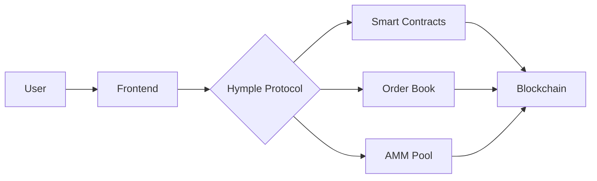
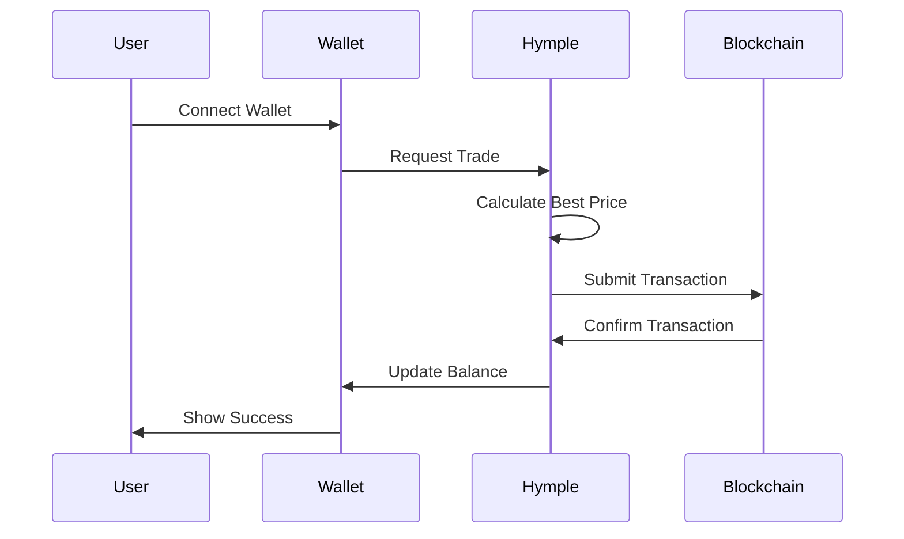

# Exemplo de Recursos Profissionais

Este arquivo demonstra os recursos visuais profissionais disponíveis no seu whitepaper.

## Cards de Navegação

Você pode usar cards de navegação personalizados adicionando este HTML:

```html
<div class="nav-cards">
  <a href="introduction/" class="nav-card">
    <div class="nav-card-header">
      <span class="nav-card-icon">📘</span>
      WHITEPAPER
    </div>
    <h3 class="nav-card-title">Introduction</h3>
    <p class="nav-card-description">Learn about Hymple's vision and mission</p>
  </a>
  
  <a href="from_traditional_to_hybrid/" class="nav-card">
    <div class="nav-card-header">
      <span class="nav-card-icon">🔄</span>
      TECHNOLOGY
    </div>
    <h3 class="nav-card-title">Hybrid Architecture</h3>
    <p class="nav-card-description">Discover our innovative hybrid approach</p>
  </a>
</div>
```

## Badges Crypto

Use badges para destacar conceitos importantes:

<span class="crypto-badge">Web3</span>
<span class="crypto-badge">DeFi</span>
<span class="crypto-badge">Hybrid DEX</span>

## Feature Grid

```html
<div class="feature-grid">
  <div class="feature-card">
    <div class="feature-icon">⚡</div>
    <h3 class="feature-title">High Performance</h3>
    <p class="feature-description">Lightning-fast transactions with minimal fees</p>
  </div>
  
  <div class="feature-card">
    <div class="feature-icon">🔒</div>
    <h3 class="feature-title">Secure</h3>
    <p class="feature-description">Bank-grade security with decentralized custody</p>
  </div>
  
  <div class="feature-card">
    <div class="feature-icon">🌐</div>
    <h3 class="feature-title">Cross-Chain</h3>
    <p class="feature-description">Trade across multiple blockchains seamlessly</p>
  </div>
</div>
```

## Admonitions (Callouts)

!!! note "Nota Importante"
    Use admonitions para destacar informações importantes no seu whitepaper.

!!! tip "Dica Profissional"
    Esta é uma dica útil para seus leitores.

!!! warning "Aviso"
    Alertas importantes aparecem assim.

!!! success "Sucesso"
    Destaque conquistas e benefícios.

!!! danger "Crítico"
    Informações críticas que requerem atenção especial.

## Code Blocks com Syntax Highlighting

```python
# Python example
def calculate_liquidity_pool(token_a: float, token_b: float) -> float:
    """Calculate constant product for AMM"""
    return token_a * token_b

pool_constant = calculate_liquidity_pool(1000, 5000)
print(f"Pool constant: {pool_constant}")
```

```solidity
// Solidity Smart Contract
pragma solidity ^0.8.0;

contract HympleToken {
    string public name = "Hymple";
    string public symbol = "HYM";
    uint256 public totalSupply;
    
    mapping(address => uint256) public balanceOf;
    
    constructor(uint256 _initialSupply) {
        totalSupply = _initialSupply;
        balanceOf[msg.sender] = _initialSupply;
    }
}
```

```javascript
// JavaScript/TypeScript example
const calculateSlippage = (inputAmount, outputAmount, expectedRate) => {
  const actualRate = outputAmount / inputAmount;
  const slippage = ((expectedRate - actualRate) / expectedRate) * 100;
  return slippage.toFixed(2);
};
```

## Tabs

=== "Buy"
    Passo a passo para comprar tokens:
    
    1. Conecte sua wallet
    2. Selecione o token desejado
    3. Insira o valor
    4. Confirme a transação

=== "Sell"
    Passo a passo para vender tokens:
    
    1. Selecione o token a vender
    2. Insira a quantidade
    3. Revise a cotação
    4. Execute a venda

=== "Swap"
    Troque tokens instantaneamente:
    
    1. Escolha o par de tokens
    2. Defina os valores
    3. Confira as taxas
    4. Finalize o swap

## Tabelas Profissionais

| Feature | Hymple | Traditional DEX | CEX |
|---------|--------|-----------------|-----|
| **Speed** | ⚡ Ultra Fast | 🐌 Slow | ⚡ Fast |
| **Fees** | 💰 Low | 💰💰 Medium | 💰💰💰 High |
| **Security** | 🔒 High | 🔒 High | 🔓 Medium |
| **Custody** | ✅ Self | ✅ Self | ❌ Centralized |
| **KYC** | ✅ Optional | ❌ None | ✅ Required |

## Listas de Tarefas

- [x] Arquitetura do sistema definida
- [x] Smart contracts auditados
- [x] Frontend desenvolvido
- [ ] Launch na mainnet
- [ ] Programa de incentivos
- [ ] Mobile app

## Fórmulas Matemáticas

Inline math: A fórmula do produto constante é \(x \times y = k\)

Display math:

\[
Price = \frac{\Delta y}{\Delta x} = \frac{y}{x}
\]

Fórmula de slippage:

\[
Slippage = \frac{Expected\_Price - Actual\_Price}{Expected\_Price} \times 100\%
\]

## Diagramas Mermaid





## Emojis e Ícones

Você pode usar emojis diretamente: 🚀 💎 🌟 ⚡ 🔥 💰 📈 🎯

Ou usar códigos: :rocket: :gem: :star: :zap: :fire: :moneybag: :chart_with_upwards_trend: :dart:

## Destaques de Texto

Use **negrito** para ênfase, *itálico* para conceitos, e ==marcação== para destaques importantes.

Você também pode usar ~~tachado~~ para texto removido e ++sublinhado++ para adições.

## Links e Referências

[Link para Introduction](introduction.md)

[Link externo para Ethereum](https://ethereum.org){ target="_blank" }

[Link com tooltip](# "Este é um tooltip explicativo")

---

## Conclusão

Todos esses recursos estão disponíveis para criar um whitepaper profissional e visualmente atraente! 🎨✨
